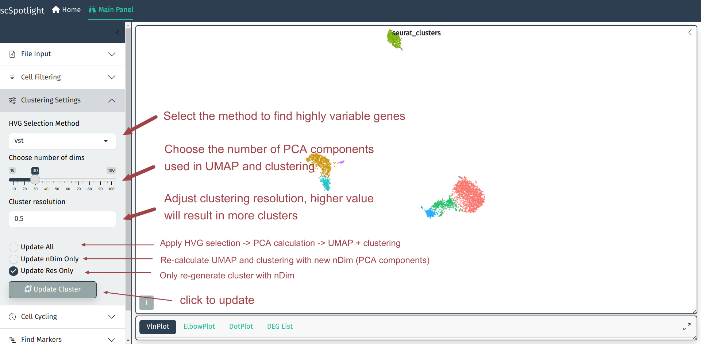
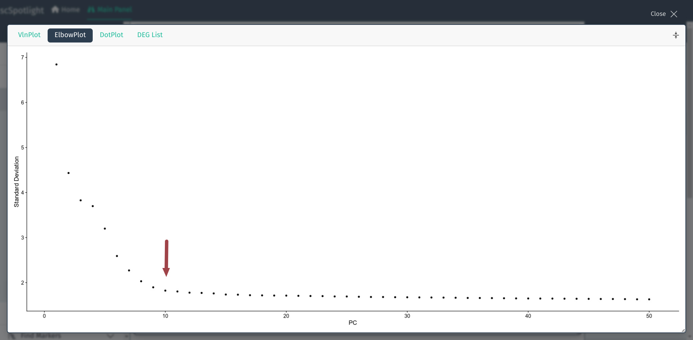
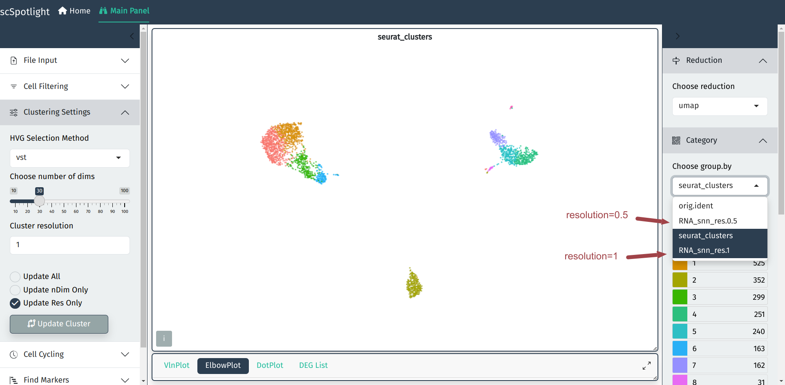

在单细胞分析中默认参数得到的分群结果有时并不能完全满足用户的需求,
scSpotlight可以协助用户根据分群结果方便的调整分群参数. 用户可以调整
寻找高可变基因的方法, UMAP和无监督分群中使用到的PCA成分数量, 以及
无监督分群的分辨率. 分辨率越高时得到的cluster数量越多, 用户常常需要
根据不同的数据集和研究的生物学问题调整分群的参数, 找到稀有的细胞类群.

nDim的选择并没有绝对的默认值, 常常根据每个PCA成分对数据变化的"贡献度"
来决定, Seurat流程中常使用肘形图, 用户可以展开面板查看,
y轴是PCA成分可以解释的数据变化比例, x轴是根据贡献度排序的成分值, 
选择"拐点"的成分值即可. 例如[Seurat pbmc3k教程](https://satijalab.org/seurat/articles/pbmc3k_tutorial)中使用了nDim=10.

更新分辨率后, 不同的分辨率的结果可以通过在右侧切换分组信息查看.

