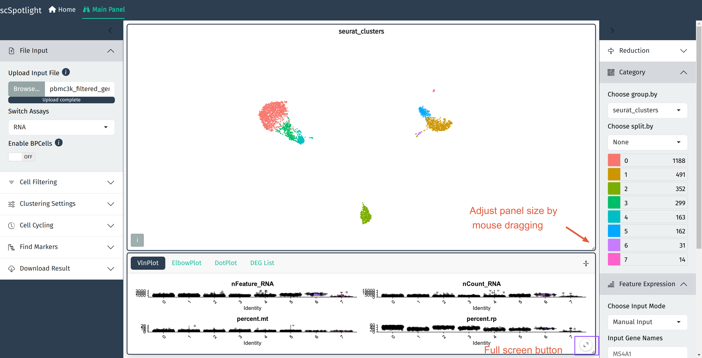
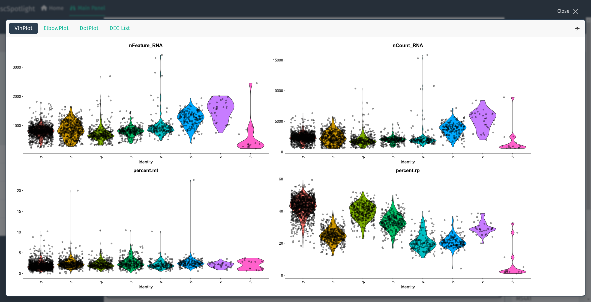
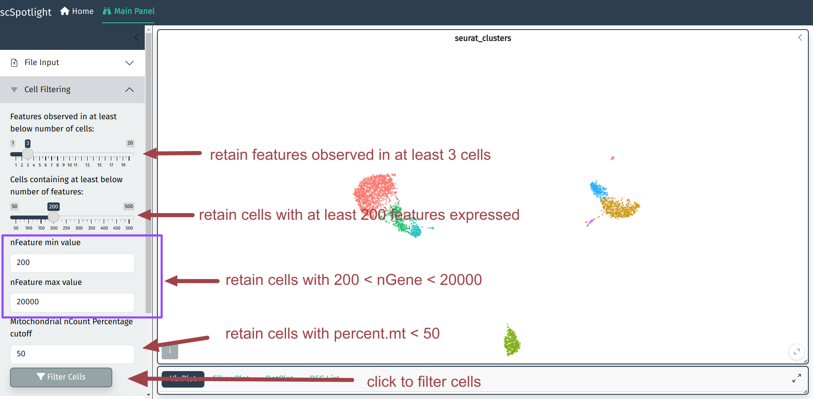
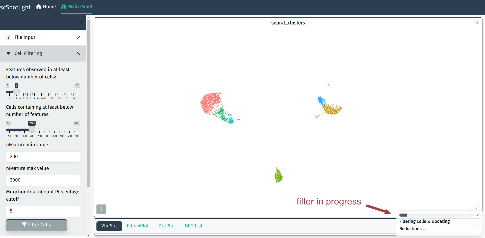

After uploading compressed matrix tarball, scSpotlight will
automatically process the data with a standard Seurat workflow
and illustrate the UMAP and cell clusters in the main panel.
The number of genes detected (nFeature\_RNA) in each cell, 
number of UMIs (nCount\_RNA), percentage of the mitochondrial 
UMIs (percent.mt), percentage of the ribosomal protein
UMIs (percent.rp) will be summarized via a violin plot in 
the lower information panel.

After expanding the informaiton panel, user could drag the 
lower right corner of the main panel to adjust the panel size.

## QC metrics and filtration criteria

Here we use the same QC metrics and filtering criteria as Seurat tutorial:

1. Discard cells/droplets with too few genes detected or too many genes.
>- Low-quality cells or empty droplets will often have very few genes
>- Cell doublets or multiplets may exhibit an aberrantly high gene count
>- Similarly, the total number of molecules detected within a cell (correlates strongly with unique genes), thus only filter nGene is sufficient

2. Discard cells/droplets with high percentage UMIs belonging to mitochondrial mRNA
>  - Low-quality / dying cells often exhibit extensive mitochondrial contamination
>  - We calculate mitochondrial QC metrics with the PercentageFeatureSet() function, which calculates the percentage of counts originating from a set of features
>  - We use the set of all genes starting with MT- as a set of mitochondrial genes

## Discard low quality cells

User could adjust cell filtering criteria, different dataset (with varies sequencing depth) 
might need to use different maximum number of genes.

