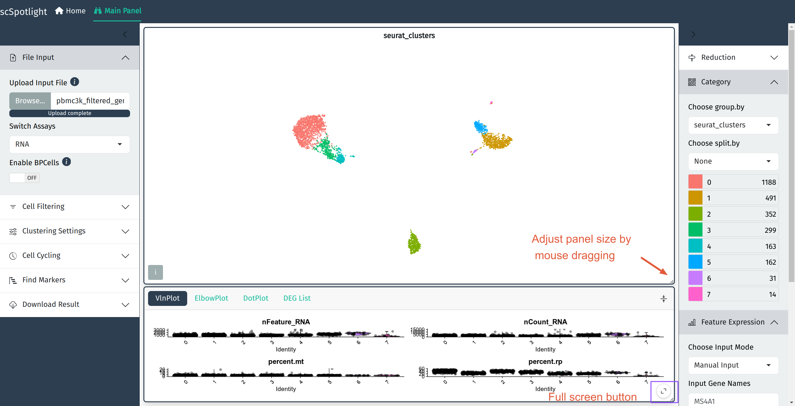
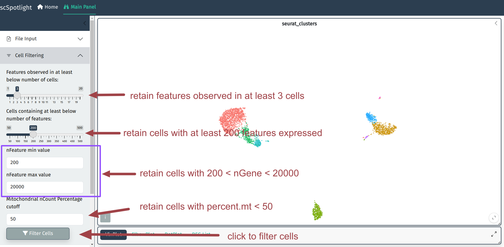
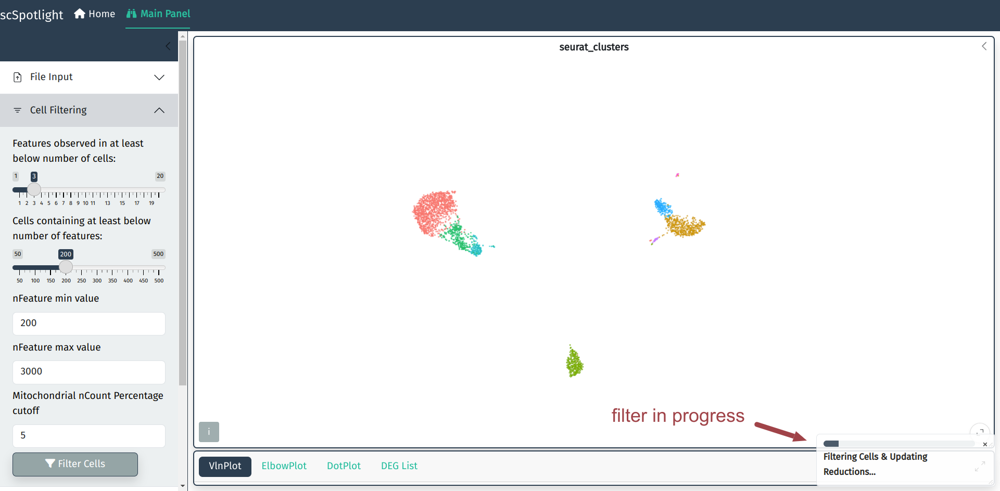

如果使用压缩的矩阵文件作为输入, scSpotlight会自动使用未过滤的细胞和基因
执行"标准化"的分析, 并展示降维和无监督分群的结果. 同时数据集中每个细胞
的基因数(nFeature\_RNA), UMI数(nCount\_RNA), 线粒体UMI比例(percent.mt)
以及核糖体UMI比例(percent.rp)会统计成小提琴图, 呈现在下方的信息面板内.

展开信息面板后, 用户可以点击右下角的全屏按钮全屏展示也可以使用鼠标拖拽
主面板和信息面板右下角的小三角调整面板大小.

## 低质量细胞的过滤标准

低质量细胞过滤的具体过程请参考Seurat的分析文档, 这里保持和Seurat的标准流程一致,
过滤的内容主要包括如下:

- 每个液滴(细胞)中检测到的基因数
  - 背景液滴和低质量细胞的液滴通常检测到的基因数较少
  - 同一个液滴中包括多个细胞时检测到的基因数也会显著高于其他液滴
- 每个液滴(细胞)中检测到的UMI(mRNA)数
  - UMI通常和基因数高度相关, 所以可以仅过滤基因数
- 每个液滴中检测到的线粒体UMI比例
  - 低质量的细胞或者正在死亡的细胞通常会含有较高的线粒体mRNA

## 过滤低质量细胞

用户可以在细胞过滤模块调整过滤的标准, 根据数据集通常需要调整最大基因数和
线粒体UMI比例的cutoff.

