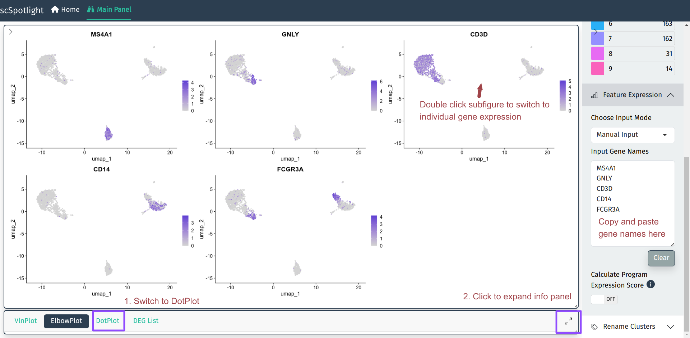
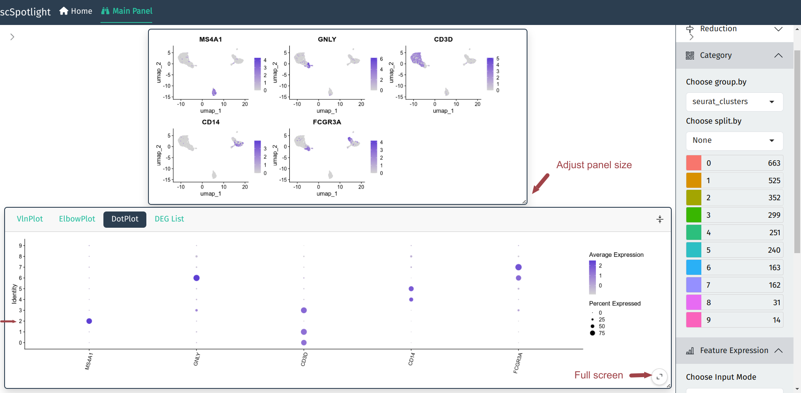

The most frequent request during scRNAseq analysis might be checking
genes' expression, manually annotating cell type is to align
marker gene expression to unsupervised cell clusters. This process
requires user to repeatedly tune the clustering parameters and 
verify markers' expression in the results. scSpotlight tries to 
simplify gene query process and make the whole step easier and
more intuitive.

## Multiple Genes

User could input multiple gene names (symbols) in the **Feature Expression**
module and the main plot panel will switch to Seurat::FeaturePlot to
represent gene expression on UMAP plot. User could also check the expression
in Seurat::DotPlot, which could better dipict the percentage of cells
in the cluster expressing the gene of interest.

## Individual Gene

For individual genes, user could double click the subfigure of the
FeaturePlot to "zoom in". The UMP/TSNE of the cell clusters and the 
gene expression will be shown side by side. Hovering category 
labels will highlight the cells of the cluster. Meanwhile, one also 
could view the gene expression in the Seurat::VlnPlot after expanding
the info panel.

<video controls width="100%">
  <source src="individual_gene_expr.mp4" type="video/webm" />
</video>
