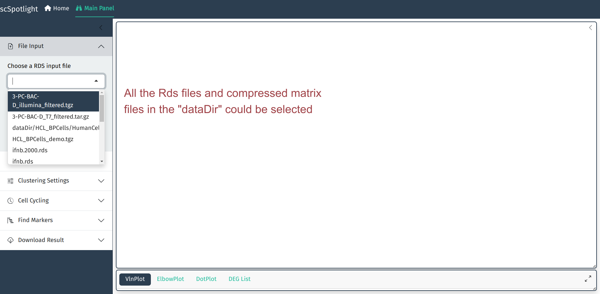

To start using scSpotlight, please use the command below and access the app via: `127.0.0.1:8081`

```R
scSpotlight::run_app(options = list(port = 8081, host = "0.0.0.0"))
```


The default mode of app is `processing`. User could also change mode to `viewer`, which will only allow illustrating
dataset and querying gene expressions:


```R
scSpotlight::run_app(options = list(port = 8081, host = "0.0.0.0"), runningMode = "viewer")
```


If one needs to load a very large dataset, use `dataDir` parameter to mount data directory and load `Rds` file directly.

```R
scSpotlight::run_app(options = list(port = 8081, host = "0.0.0.0"), runningMode = "viewer", dataDir = "/path/to/data_directory")
```


