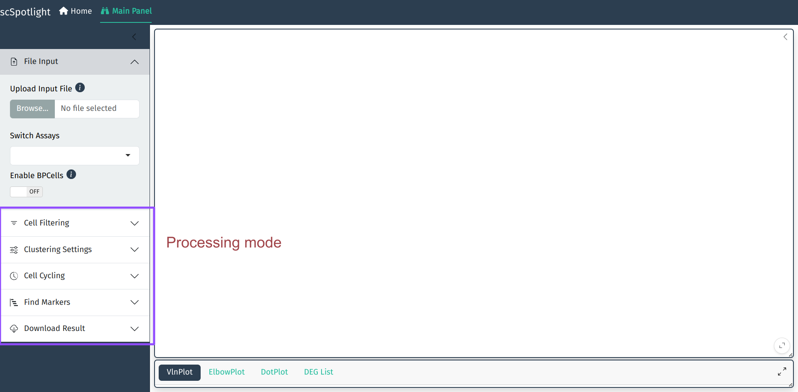
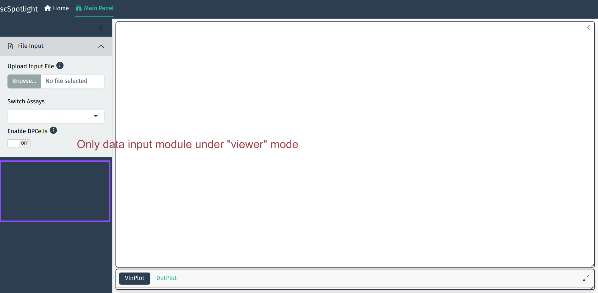
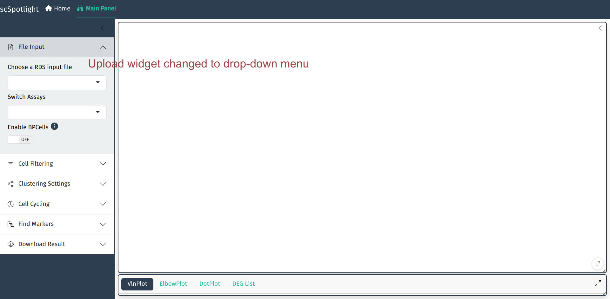
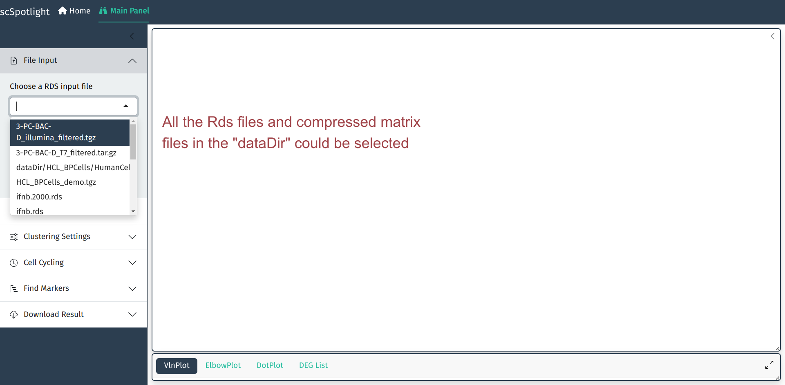

用户在R console中可以使用如下命令启动app, 然后在浏览器中访问网址`127.0.0.1:8081`使用app.

```R
scSpotlight::run_app(options = list(port = 8081, host = "0.0.0.0"))
```



`scSpotlight`的默认启动模式是`processing`. 用户可以切换到`viewer`模式, 仅仅作分群的展示和查看
基因表达.

```R
scSpotlight::run_app(options = list(port = 8081, host = "0.0.0.0"), runningMode = "viewer")
```



如果载人的数据较大, 可以使用`dataDir`参数指定存放数据的位置. 此时data loading部分会变成下拉菜单,
用户可以从菜单选取需要载入的`Rds`文件.

```R
scSpotlight::run_app(options = list(port = 8081, host = "0.0.0.0"), runningMode = "viewer", dataDir = "/path/to/data_directory")
```




